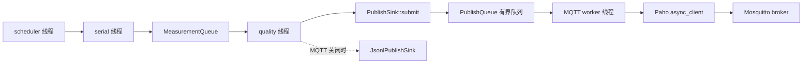

# P3-S4-T02：异步 MQTT 发布与有界缓存

> 文档状态：已审核固化。  
> 对应实现：`P3-S4-T02`。  
> 适用版本：Industrial-IOT-Gateway 当前 C++17 实现、MQTT 3.1.1、Eclipse Paho MQTT
> C++ 1.2.0、Paho MQTT C 1.3.13、Mosquitto 2.0.18。  
> 证据边界：本文只解释已经落地并通过本地软件测试的实现，不代表 TLS、生产 broker、真实
> RS485 或硬件台架已验证。

## 1. 本工作块解决什么问题

S3 结束时，网关已经能够通过串口轮询 Modbus 从站、解码寄存器并把事件写到 JSONL。T02
要解决的是：如何把这些遥测可靠地送到 MQTT broker，同时保证网络异常不会拖慢串口采集。

这看似只是调用一次 `publish()`，但实际包含五个相互制约的问题：

1. broker 可能断线，网络调用的耗时不可控；
2. 串口仍在持续产生数据，内存不能无限积压；
3. 普通遥测可以用新值覆盖旧值，但质量变化和设备状态不能静默丢失；
4. QoS 1 允许重复交付，消费者需要能够识别顺序和重复；
5. 进程关闭时既要尽量排空消息，也不能无限等待网络。

因此，本工作块的核心不是“会发 MQTT”，而是建立一个位于采集链路与网络链路之间的、有界
且可观测的异步边界。

## 2. 所需术语和基础概念

### 2.1 同步与异步

同步调用（synchronous call）通常要等操作完成后才返回。如果质量线程直接执行网络发布，
一次 DNS、TCP 或 broker 故障就可能让该线程停在网络调用中。

异步调用（asynchronous call）把“提交工作”和“等待工作完成”分开。本项目中：

- 质量线程只调用 `PublishSink::submit()`，把消息放入有界队列；
- `MqttPublishSink` 自己的 worker 线程负责连接、序列化、发布和等待 QoS 1 确认；
- Paho 内部仍有网络线程处理 MQTT 报文；项目 worker 通过 token 的有限时等待观察结果。

当前实现没有把 Paho 回调对象暴露给 `gateway_core`，也没有在项目回调中执行业务逻辑。这样
可以把 Paho 的类型和线程模型限制在 `gateway_mqtt` 库内部。

### 2.2 有界队列、背压与高水位

有界队列（bounded queue）有固定容量。它不能消灭过载，但能把过载变成明确结果：接受、
合并、队列满或关闭，而不是把内存持续吃光。

背压（backpressure）是下游变慢后向上游暴露压力的机制。本项目的 `submit()` 不等待空位；
队列无法接受时立即返回状态并计数，避免质量线程被网络速度反向阻塞。

高水位（high watermark）不是总容量。默认 MQTT 队列容量为 1024，高水位为 820：普通
fresh 遥测最多使用到高水位，剩余空间留给质量变化、设备状态和关闭状态等关键事件。

### 2.3 合并与丢弃

合并（coalescing）指队列中已经存在同一 topic 的 fresh 遥测时，用新值替换旧值。温度先后
变为 25.1、25.2、25.3，而 broker 此时离线，恢复后通常只需要最新的 25.3。

以下消息不参与这种覆盖：

- stale、offline、invalid 等非 fresh 遥测；
- `QualityTransitionEvent`；
- `DeviceStatusEvent`；
- `GatewayHealthEvent`；
- 写操作审计事件。

它们记录的是状态变化或审计事实，随意覆盖会破坏因果链。即使如此，关键事件仍受总容量
限制；队列彻底满时会明确增加 `critical_enqueue_failures`，而不是宣称“绝不丢失”。

### 2.4 Clean Session 与应用缓存

T01 冻结使用 MQTT 3.1.1 clean session。每次连接都从新的 MQTT 会话开始，不依赖 broker
替客户端长期保存离线会话状态。因此，网关在应用层自行维护有界缓存。

应用缓存和 MQTT QoS 是两个层次：

- 应用缓存决定“还没交给 broker 的业务消息怎么办”；
- QoS 1 决定 MQTT 发送方和接收方如何确认一次交付。

QoS 1 是“至少一次”（at least once），可能重复，所以 payload 中的 `run_id` 和单调
`sequence` 是消费者去重与排序的依据。

### 2.5 指数退避与抖动

如果 broker 离线，立即无限重连会制造忙循环和“惊群”。本项目的名义退避序列固定为：

`1、2、4、8、16、30 秒`，随后保持 30 秒。

每次延迟再加入 ±20% 抖动（jitter）。多个网关即使同时断线，也不会在完全相同的时刻反复
冲击 broker。测试用强类型 `JitterSample` 传入抖动样本，避免把失败次数和浮点样本误换。

## 3. 本项目中的数据流和线程角色



各角色的边界如下：

| 角色 | 负责 | 明确不负责 |
|---|---|---|
| scheduler | 生成轮询请求 | MQTT 连接和发布 |
| serial | Modbus RTU 收发 | JSON 序列化和 broker 重连 |
| quality | 解码、freshness、stale/offline 快照 | 等待网络确认 |
| PublishQueue | 容量、合并、关键容量预留 | MQTT 协议状态机 |
| MQTT worker | 连接、重连、序列化、QoS 1 token、排空 | 串口锁和轮询调度 |
| Paho 内部线程 | TCP/MQTT 报文处理 | 项目业务状态机 |

最重要的隔离规则是：MQTT worker 不持有运行时调度锁或串口锁执行网络调用。集成测试实际
停止 Mosquitto 后，`requests_succeeded` 仍继续增长，证明 broker 故障没有冻结 PTY 轮询。

## 4. 关键类、接口和源码执行过程

### 4.1 `PublishSink`：把运行时与具体输出解耦

`include/industrial_iot_gateway/publish/publish_sink.hpp` 定义统一接口：

```cpp
class PublishSink {
public:
  virtual bool start() = 0;
  virtual QueuePushStatus submit(PublishMessage message) = 0;
  virtual void request_stop(steady_clock::time_point drain_deadline) noexcept = 0;
  virtual void join() noexcept = 0;
  virtual PublishSinkStatistics statistics() const = 0;
};
```

`gateway_core` 只依赖这层抽象。MQTT OFF 时使用 `JsonlPublishSink`；MQTT ON 且命令行提供
完整 MQTT 参数组时，应用注入 `MqttPublishSink`。因此 Paho 类型没有进入核心库的公开接口。

### 4.2 `PublishQueue`：按消息语义决定是否合并

`src/pipeline/event_pipeline.cpp` 先判断消息是否为 fresh `TelemetryEvent`：

- 是：按 topic 查找待发送 fresh 消息，有则替换；没有则只允许插入到高水位；
- 否：使用总容量插入，不进行 topic 覆盖。

底层 `BoundedQueue` 用一个互斥锁保护队列与统计值，用条件变量唤醒消费者。所有统计快照也
在同一把锁下读取，因此 TSan 能验证读写同步关系。

### 4.3 `MqttPublishSink::submit()`：快速交接

调用顺序是：

1. 若已进入关闭状态，返回 `closed`；
2. 为遥测、设备状态和网关健康补齐 `run_id`、`sequence` 与时间戳；
3. 更新“最后设备状态/最后遥测”快照；
4. 根据消息类型进入有界队列；
5. 更新 `coalesced`、`dropped`、`critical_enqueue_failures`；
6. 唤醒 MQTT worker 后立即返回。

这里没有调用 Paho 的 `publish()`，所以采集线程不会等待网络。

### 4.4 启动和连接

`gateway_app` 只有收到以下完整参数组才启用 MQTT：

```text
--mqtt-broker-uri URI --mqtt-client-id ID --gateway-id ID
```

少一个参数会以用法错误退出；整组省略则保留 JSONL 路径。MQTT 代码还必须在 CMake 中通过
`GATEWAY_ENABLE_MQTT=ON` 编译。

worker 创建一个 `mqtt::async_client`，连接选项固定为 MQTT 3.1.1、clean session、QoS 1
LWT、keep-alive 20 秒、关闭 Paho 自动重连。自动重连关闭是为了让本项目自己的退避、抖动、
指标和快照顺序成为唯一状态机。

连接成功后先发布 retained 的 gateway health `online`，再发布设备状态快照和仍有意义的
非 fresh 遥测快照，最后继续处理普通队列。

### 4.5 正常发布和过期判断

`PayloadSerializer` 只序列化三种 MQTT 消息：telemetry、device status 和 gateway health。
内部质量转换与写审计仍留在本地可观测链路，不被误当作冻结 MQTT payload。

每次 Paho `publish()` 返回 token。worker 以 25 ms 小步等待，直到：

- QoS 1 token 完成；
- 到达本次确认期限；
- Paho 报告连接丢失。

离线期间缓存的 fresh 遥测在真正发布前会检查 `freshness_deadline`。已过期的消息增加
`expired_fresh_dropped`，不会在数秒后仍伪装成 fresh 发布。质量线程生成的 stale/offline
消息则携带最后有效值，并设置 `value_is_retained=true`；若从未有有效样本，则使用 null
原始值、无工程量且 `value_is_retained=false`。

### 4.6 断线和重连

worker 循环观察 `async_client::is_connected()`。断线后串口和质量线程继续运行，MQTT worker
按冻结退避序列调度下一次连接。Paho 的一次连接 token 可能在应用等待超时边界之后才完成，
所以 worker 还会在循环中确认“已经连接但尚未记账”的状态，避免漏记连接和漏发恢复快照。

### 4.7 关闭路径和对象所有权

运行时关闭顺序是：

1. 停止 scheduler；
2. 等待 serial 退出；
3. 等待 quality 退出，保证不再产生新发布消息；
4. 给发布器一个最多 2000 ms 的排空期限；
5. 发布 retained `stopping`，排空可确认消息，再发布 retained `offline`；
6. 发送 MQTT DISCONNECT 并结束 worker。

总进程关闭预算仍是 5000 ms。若期限到达仍有消息，记录 `drain_expired` 和
`unconfirmed_on_close`，不会无限等待。

Paho 的 disconnect token 由 `MqttPublishSink` 保持到 `async_client` 销毁之后。原因是 Paho
内部网络线程可能仍在完成 token 的条件变量广播；过早销毁 token 会造成生命周期竞态。该
所有权顺序由 TSan 用例覆盖。

## 5. 指标如何读

`PublishSinkStatistics` 暴露：

| 指标 | 含义 |
|---|---|
| `connected_events` / `disconnected_events` | 连接状态转换次数 |
| `connect_attempts` / `reconnect_scheduled` | 连接尝试与退避调度 |
| `publish_attempts/successes/failures` | MQTT 发布尝试和结果 |
| `queue.maximum_depth` | 队列实际高水位峰值 |
| `coalesced` | 被同 topic 新 fresh 值替换的旧消息数 |
| `dropped` | 因满、关闭、超期等未继续发送的消息数 |
| `expired_fresh_dropped` | 因 freshness 到期而丢弃的 fresh 消息数 |
| `critical_enqueue_failures` | 关键事件因总容量耗尽而入队失败 |
| `drain_expired` / `unconfirmed_on_close` | 关闭期限耗尽及未确认数量 |

这些指标会进入 `gateway_summary`。指标说明发生了什么，但不能代替消息级测试；例如
`publish_successes` 增长不自动证明 payload 字段符合合同。

## 6. 为什么选择当前方案

### 6.1 为什么不用质量线程直接调用 MQTT

串口轮询是网关的主要职责，broker 是可故障的下游。把两者放在同一调用链会让下游故障破坏
上游采集时序。独立 worker 让网络背压在有界队列处被显式处理。

### 6.2 为什么保留 JSONL sink

它使 MQTT 可以在编译期和运行期分别关闭，也让核心 PTY 测试不需要 broker。`PublishSink`
还为以后增加文件、测试记录器或其他上行协议保留了稳定边界。

### 6.3 为什么 fresh 可以合并，质量变化不能

普通遥测表达“当前值”，旧值通常被新值支配；质量变化表达“状态曾经改变”，覆盖会丢失
历史。该策略是在有限内存中优先保留语义，而不是简单的 FIFO 全保留承诺。

### 6.4 为什么用应用缓存而不是持久会话

T01 已冻结 clean session。本项目需要自己定义容量、合并、过期和关闭行为，避免把关键语义
隐藏在 broker 或客户端库的默认离线缓存中。当前缓存只在内存中，进程崩溃后不恢复。

### 6.5 为什么 MQTT 只负责上行

当前项目没有 MQTT 下行写寄存器。下行命令涉及鉴权、重放保护、权限、幂等、危险寄存器和
审计闭环，不能因为已经有 MQTT 连接就顺手开放。

## 7. 常见错误、失败模式和安全边界

- 把 MQTT RETAIN 和 payload 的 `value_is_retained` 混为一谈：前者由 broker 保存消息，
  后者表示业务值是否沿用历史样本。
- 认为 QoS 1 等于“恰好一次”：QoS 1 可能重复，消费者仍需使用 `run_id + sequence`。
- 使用无界 `std::queue`：broker 长期离线时会持续增长内存。
- 队列满后静默覆盖关键状态：会让 offline/recovered 因果链断裂。
- 重连无退避：会产生忙循环和惊群。
- 重连后先发旧 fresh：恢复时该值可能早已过期，应丢弃或以 stale/offline 语义发布。
- 在持有运行时锁时调用网络：会把网络尾延迟传播到串口线程。
- 关闭时无限 drain：systemd 或人工停止可能永久卡住。
- 只看一次测试成功：异步生命周期问题需要 TSan 和重复的 broker 故障测试。
- 把回环匿名 broker 当成生产安全方案：本工作块没有 TLS、账号、ACL、证书轮换或跨主机
  网络验证。

## 8. 本工作块完成与未完成的能力

### 8.1 已完成

- `gateway_mqtt` 独立库和 `GATEWAY_ENABLE_MQTT` 开关；
- Paho C++ 1.2.0 / Paho C 1.3.13 / nlohmann-json 3.11.3 固定依赖；
- MQTT 3.1.1、QoS 1、retained health/status/LWT；
- PublishSink 抽象、JSONL 回退和不泄漏 Paho 类型的核心接口；
- 独立 worker、有界队列、fresh 合并、关键容量预留；
- stale/offline 最后有效值快照与 invalid 工程量省略；
- 断线后串口继续、重连退避与恢复快照；
- 连接、发布、队列、丢弃和关闭指标；
- MQTT 最多 2000 ms 排空、总关闭预算不扩张；
- Debug、ASan/UBSan、Release、clang-tidy、TSan、clang-format 和 CTest 软件证据。

### 8.2 未完成

- TLS、用户名密码、ACL、生产证书和远程 broker；
- 磁盘持久缓存和进程崩溃后的离线消息恢复；
- MQTT 下行控制；
- T03 的 F01–F15 故障 runner、慢消费者和统一结果 schema；
- 真实 USB-RS485/STM32 台架；
- systemd 和 ARM64 部署验收。

## 9. 后续学习资料

以下资料均在 2026-08-09 访问：

1. [OASIS MQTT 3.1.1 标准及勘误整合版](https://docs.oasis-open.org/mqtt/mqtt/v3.1.1/mqtt-v3.1.1.html)：重点阅读 3.1 CONNECT、3.3 PUBLISH、4.3 QoS 和 4.4 重传；适用于本项目冻结的 MQTT 3.1.1。
2. [Eclipse Paho C++ 项目页](https://eclipse.dev/paho/clients/cpp/)：了解 C++ 封装与 Paho C 后端关系；本项目使用 Ubuntu 包 1.2.0-2。
3. [Paho C++ `async_client` API](https://eclipse.dev/paho/files/cppdoc/classmqtt_1_1async__client.html)：了解连接、发布 token、消费接口和客户端生命周期；页面是官方生成文档，具体行为以 1.2.0 头文件为准。
4. [Paho MQTTAsync 官方线程说明](https://eclipse-paho.github.io/paho.mqtt.c/MQTTAsync/html/async.html)：理解 Paho 内部线程和回调来源；本项目后端为 Paho C 1.3.13。
5. [Eclipse Mosquitto broker 手册](https://mosquitto.org/man/mosquitto-8.html)：学习本地 broker 启动参数；本项目验收使用 2.0.18。
6. [Mosquitto 发布客户端手册](https://mosquitto.org/man/mosquitto_pub-1.html)：对照 QoS、retain、will 和协议版本选项。
7. [CMake `option()` 官方文档](https://cmake.org/cmake/help/latest/command/option.html)：理解 `GATEWAY_ENABLE_MQTT` 这类构建期开关。
8. [cppreference `std::condition_variable`](https://en.cppreference.com/w/cpp/thread/condition_variable)：补充理解有界队列的等待、通知和互斥关系；它是参考资料，不替代 ISO C++ 标准文本。

建议阅读顺序是：先复习 T01 消息合同，再读 OASIS 的 CONNECT/PUBLISH/QoS，随后对照
`PublishQueue`、`MqttPublishSink::submit()`、worker 循环和关闭路径，最后阅读两项 Mosquitto
集成测试。这样能把协议语义、并发边界和实际代码连成一条线。
