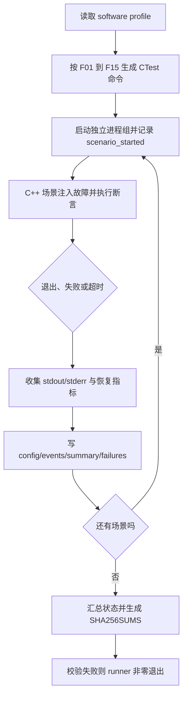

# P3-S4-T03：故障注入与可观测性

> 文档状态：已审核固化  
> 对应实现：`P3-S4-T03` 已实现版本  
> 适用环境：Ubuntu 24.04、Python 3.12.3、CMake/CTest 3.28.3、Mosquitto 2.0.18、Eclipse Paho MQTT C++ 1.2.0  
> 访问与核对日期：2026-08-09

## 1. 本工作块解决什么问题

S3 和 S4-T02 已经证明网关在正常条件下能够通过 PTY 轮询 Modbus RTU 从站，并把遥测异步
发布到 MQTT。但是“正常路径运行成功一次”不能回答下面这些工程问题：

- 从站不响应、返回坏 CRC 或截断帧时，网关是否会无限重试或把坏数据当成正确数据；
- 串口断开、broker 离线或 PUBACK 变慢时，串口采集线程是否仍能继续工作；
- 请求、测量和 MQTT 发布队列达到容量时，系统是否有界，丢弃是否可见；
- stale、offline、invalid 是否仍遵守消息合同；
- SIGTERM 到来时能否在预算内停止，是否遗留子进程或未确认消息；
- 一次测试失败后，能否继续执行其余场景并留下可追踪证据。

T03 为这些问题增加了可重复执行的软件故障矩阵（fault matrix）。它不依赖人工浏览一大段
终端日志判断成败，而是让每个场景由测试断言充当预言机，再由 runner 汇总退出码、超时、
恢复时间、事件 ID 和校验和。

## 2. 所需术语和基础概念

### 2.1 故障、错误和失效

- **故障（fault）**：被注入的异常原因，例如从站静默、CRC 被破坏、broker 停止响应。
- **错误（error）**：软件内部出现的异常状态，例如 CRC 校验失败、队列返回 `full`。
- **失效（failure）**：系统对外没有满足合同，例如坏帧被发布、串口轮询被 MQTT 阻塞、关闭超时。

故障注入不是“故意把程序弄崩”，而是在受控条件下验证错误能否被发现、隔离、分类和恢复。

### 2.2 测试刺激、预言机和证据

- **测试刺激（test stimulus）**：触发异常的动作，例如切换 PTY 的 `FaultPlan`、关闭 broker、
  暂停 TCP 代理的服务端到客户端方向。
- **测试预言机（test oracle）**：机器可以判断的预期，例如 `crc_errors > 0`、其他从站仍有成功
  请求、队列最大深度不超过容量、进程在五秒内退出。
- **证据（evidence）**：支持结论的结构化记录，包括配置、事件、摘要、失败项和 SHA256。

普通测试往往只关心输入和返回值；故障注入还必须描述何时触发故障、系统在故障期间怎样表现、
何时撤销故障、怎样确认恢复，以及异常资源有没有被清理。

### 2.3 单故障和组合故障

当前 F01–F15 以单故障为主，但集成场景本身会保留正常的并发活动。例如 F11 在延迟 MQTT
PUBACK 时仍运行三个 PTY 从站、调度线程、测量流水线和 MQTT worker。这能验证“网络背压不应
阻塞串口采集”这一跨组件性质，但不等于已经穷举任意多故障组合。

组合故障会显著扩大状态空间，应在单故障的分类和恢复路径稳定后再增加，否则很难区分根因。

## 3. 故障矩阵的工作原理

### 3.1 为什么使用 Python runner 和 C++ 测试场景

runner 使用 Python 3.12 标准库完成进程编排和证据写入；真正理解网关内部状态的预言机放在
C++ GoogleTest 中。这样分工的原因是：

- Python 的 `subprocess.Popen` 适合启动、等待、超时和收集子进程输出；
- C++ 测试可以直接读取 `GatewayRuntimeStatistics`、队列统计和发布器指标；
- CTest 已经拥有测试发现、正则筛选、超时和统一退出码；
- runner 不需要复制一套网关业务判断，也不通过脆弱的自然语言日志关键字猜测成败。

runner 调用命令时传递参数数组，并设置 `shell=False`，避免 profile 内容被 shell 二次解释。
每个场景通过 `start_new_session=True` 建立独立进程组。超时后先发送 SIGTERM，宽限期结束仍未
退出时发送 SIGKILL，最后必须 `wait()` 回收子进程。

### 3.2 执行流程

一个场景失败不会阻止剩余场景执行。这样最终报告能同时回答“哪些通过”和“哪些失败”，不会因
第一个错误而丢失后续诊断机会。

### 3.3 F01–F15 对应的故障面

| ID | 故障刺激 | 关键预言机 |
|---|---|---|
| F01 | 从站静默 | timeout 有界，其他从站继续轮询 |
| F02 | 延迟响应 | 延迟路径不破坏请求匹配与后续轮询 |
| F03 | 坏 CRC | CRC 错误被分类，坏帧不进入正确数据路径 |
| F04 | 截断响应 | 截断帧被识别，重试和失败保持有界 |
| F05 | 异常响应 | 0x01–0x04 均作为 Modbus 异常，而非 timeout |
| F06 | 串口断开再连接 | 串口可重开并恢复成功请求 |
| F07 | 显式请求队列满 | `push()` 返回 `full`，深度不超过容量 |
| F08 | 测量消费者暂停 | 测量队列满可见，拒绝计数可观察 |
| F09 | MQTT 发布队列满 | fresh 可合并，关键质量/状态事件不静默覆盖 |
| F10 | broker 断开再启动 | 串口吞吐继续，MQTT 能重新连接 |
| F11 | PUBACK 延迟 | 串口继续、队列有界、恢复后出现新的发布成功 |
| F12 | invalid 原始值 | `quality=invalid` 且省略工程量 |
| F13 | 数据过期与恢复 | stale/offline 不冒充 fresh，恢复后继续轮询 |
| F14 | SIGTERM | 五秒总预算内完成有序关闭 |
| F15 | 非法队列配置 | 创建线程前 fail-fast |

## 4. 本项目中的数据流和线程角色

网关运行时的主数据流是：

`轮询调度 → 请求队列 → 串口 I/O → RTU 解析 → 测量队列 → 质量判断 → PublishSink`

启用 MQTT 时，`MqttPublishSink` 还拥有独立 worker。串口 I/O 线程只把待发布消息放进有界队列，
不能持有运行时锁等待网络。F10 和 F11 的核心不是“MQTT 最后连上了”，而是确认 MQTT 失去进展
期间 `requests_succeeded` 仍持续增加。

T03 对运行时增加了两个重要的可配置边界：

- `GatewayRuntimeConfig::request_queue`：显式请求队列容量与公平性；
- `GatewayRuntimeConfig::measurement_queue`：测量流水线队列容量与高水位。

当测量入队不再成功时，运行时增加 `measurement_enqueue_failures`，并发出
`measurement_queue_rejected` 结构化事件。此前忽略 `push()` 返回值会形成静默数据丢失，因此
“检查有界队列的返回状态”本身就是可靠性实现的一部分。

## 5. 关键类、接口和源码执行过程

### 5.1 `tools/run_fault_matrix.py`

这是命令行入口。它负责：

1. 校验构建目录和 `--source-revision`；
2. 读取 `tests/data/fault_profiles/software.json`；
3. 为每个场景构造带 `--verbose` 的 CTest 命令；
4. 创建唯一 `run_id`；
5. 把矩阵结果映射为稳定退出码。

正式运行要求 7–40 位十六进制源码版本。runner 不自行调用 Git，这是权限边界，也避免把工作区
状态检查偷偷混入测试逻辑。没有可追溯版本时必须显式使用 `--exploratory`。

### 5.2 `tools/fault_matrix/process_manager.py`

`run_process()` 捕获 stdout/stderr，使用单调时钟计算耗时，并负责超时清理。单调时钟不会因系统
时间校准而倒退，适合计算持续时间；UTC 时间则用于人与跨系统对齐。两者用途不同，所以证据事件
同时保留 UTC 时间戳和 `monotonic_ms`。

### 5.3 `tools/fault_matrix/evidence.py`

`EvidenceWriter` 维护全局递增事件序号，生成：

`<run_id>:<scenario_id>:<六位序号>`

每个事件至少包含 schema 版本、run/scenario/event ID、双时间信息、组件、事件类型、严重级别、
结果和队列深度对象。场景摘要引用开始与完成事件 ID，使 `summary.json`、`events.jsonl` 和
`failures.json` 可以相互追踪。

### 5.4 PTY 动态故障切换

`PtySlaveServer::set_fault_plan()` 和 `PtyBusHarness::set_fault()` 允许测试运行期间改变故障计划。
server 在处理每次请求前复制一份受互斥量保护的 `FaultPlan` 快照，保证一次响应不会读到“切换到
一半”的配置。

### 5.5 慢 PUBACK 代理

F11 使用本地 TCP 代理连接 Paho client 与 Mosquitto。客户端到 broker 的字节继续转发，而
broker 到客户端方向可以暂停，因此 QoS 1 的 PUBACK 无法及时到达。此时：

- MQTT worker 等待确认；
- fresh 遥测达到普通插入上限后按 topic 合并；
- 额外容量保留给 stale/offline/status 等关键事件；
- PTY 与串口线程继续轮询；
- 恢复转发后，测试必须观察到比恢复前更多的 `publish_successes`。

这比简单停止 broker 更精确：连接仍存在，但消费者确认变慢，能覆盖“慢而不是断”的背压路径。

### 5.6 MQTT 关闭竞态修复

TSan 首轮在 F11 中发现：主线程写 `drain_deadline_` 的同时，MQTT worker 可能在
`finish_shutdown()` 读取它。修复后，专用 `shutdown_mutex_` 保护截止时间；主线程先写截止时间，
再发布 `stopping=true`，worker 读取时持有同一把锁。这体现了一个重要原则：原子布尔值只能保护
自身，不能自动让相邻的非原子对象变得线程安全。

## 6. 为什么选择当前方案

- **Python 标准库**：无需增加依赖，适合进程和证据编排。
- **CTest 正则选择**：复用已有测试发现与超时配置，场景名称可追踪到源码。
- **C++ 断言作为预言机**：判断建立在真实统计和消息对象上，不依赖人工日志解释。
- **每场景独立目录**：失败时可单独提取，不必拆分全局混合日志。
- **JSONL 事件**：可流式追加，单行损坏不会使整份长日志都无法定位。
- **SHA256SUMS**：检测证据在运行后是否被意外修改，但不提供身份签名或保密性。
- **探索性/正式运行分离**：没有提交版本时不制造虚假的可追溯性。

## 7. 常见错误、失败模式和安全边界

### 7.1 只看进程返回 0

CTest 返回 0 说明测试断言通过，但恢复场景还必须给出
`FAULT_RECOVERY_TIME_MS=<非负整数>`。F06、F10、F11、F13 缺少该指标时，runner 会把场景判为
失败。其他没有明确撤销故障阶段的场景保留 `null`，不会把整个进程耗时伪装成恢复耗时。

### 7.2 用一次成功掩盖偶发问题

一次 15/15 只能证明该环境和该次执行通过。它不能统计低概率死锁的发生率。更高置信度需要在固定
版本上多次运行、比较恢复时间分布和队列高水位，并保存每次独立 run ID。

### 7.3 无界重试和无界队列

无界重试会把永久故障变成永久占用；无界队列会把网络背压变成内存增长。当前策略要求超时、重试、
排空和队列容量都显式有界，并把 `full`、drop、coalesce、high-water 和 drain-expired 计入指标。

### 7.4 证据边界

当前矩阵只使用 PTY、回环 TCP 和匿名本地 Mosquitto。它不证明：

- 真实 RS485 的接线、终端电阻、偏置和电磁干扰表现；
- 生产 TLS、证书、鉴权和跨主机网络；
- 硬件 STM32 从站时序；
- 任意组合故障或长时间稳定性。

此外，`artifacts/baseline/` 默认被 Git 忽略。是否归档、公开或复制到外部证据库需要项目所有者
单独决定。

## 8. 本工作块完成与未完成的能力

已完成：

- Python runner 的参数、超时、进程组清理、失败继续执行和非零退出；
- F01–F15 软件故障矩阵；
- 每场景四份文件、全局摘要/环境/命令/日志与 SHA256；
- F06/F10/F11/F13 真实恢复时间；
- 请求、测量、发布队列的有界性与可观察失败；
- Modbus 0x01–0x04 异常覆盖；
- 慢 PUBACK 期间串口继续与恢复后发布进展；
- Debug、ASan/UBSan、Release、clang-tidy、TSan、clang-format 和 CTest 质量门。

尚未完成：

- 当前证据绑定到提交版本的正式 G3 基线；
- USB-RS485/STM32 硬件台架；
- 生产网络与 TLS；
- 长时间、多轮和随机组合故障统计。

## 9. 后续学习资料

以下资料均为一手或官方资料，访问日期为 2026-08-09：

1. [Python 3.12 `subprocess` 文档](https://docs.python.org/3.12/library/subprocess.html)：
   进程创建、`communicate()`、超时与安全注意事项，适用于当前 Python 3.12.3 runner。
2. [Python 3.12 `os` 文档](https://docs.python.org/3.12/library/os.html)：
   进程组、信号与 `killpg()` 的接口说明。
3. [CTest 3.28 手册](https://cmake.org/cmake/help/v3.28/manual/ctest.1.html)：
   测试筛选、verbose 输出、超时和退出状态。
4. [JSON Schema Draft 2020-12](https://json-schema.org/draft/2020-12)：
   当前 `fault_evidence.schema.json` 所声明的 schema 版本。
5. [MQTT 3.1.1 OASIS 规范](https://docs.oasis-open.org/mqtt/mqtt/v3.1.1/mqtt-v3.1.1.html)：
   QoS 1、PUBACK、会话和网络连接的协议依据。
6. [Eclipse Paho C++ `async_client`](https://eclipse.dev/paho/files/cppdoc/classmqtt_1_1async__client.html)
   与 [delivery_token](https://eclipse.dev/paho/files/cppdoc/classmqtt_1_1delivery__token.html)：
   异步客户端及发布确认 token 的生命周期。文档对应 Paho C++ 1.x API。
7. [Mosquitto 2.x 手册](https://mosquitto.org/man/mosquitto-8.html)：
   本地 broker 的启动、监听和配置边界。
8. [Clang ThreadSanitizer 文档](https://clang.llvm.org/docs/ThreadSanitizer.html)：
   数据竞态检测的工作方式、开销和限制，适用于本项目 Clang 18 质量门。
