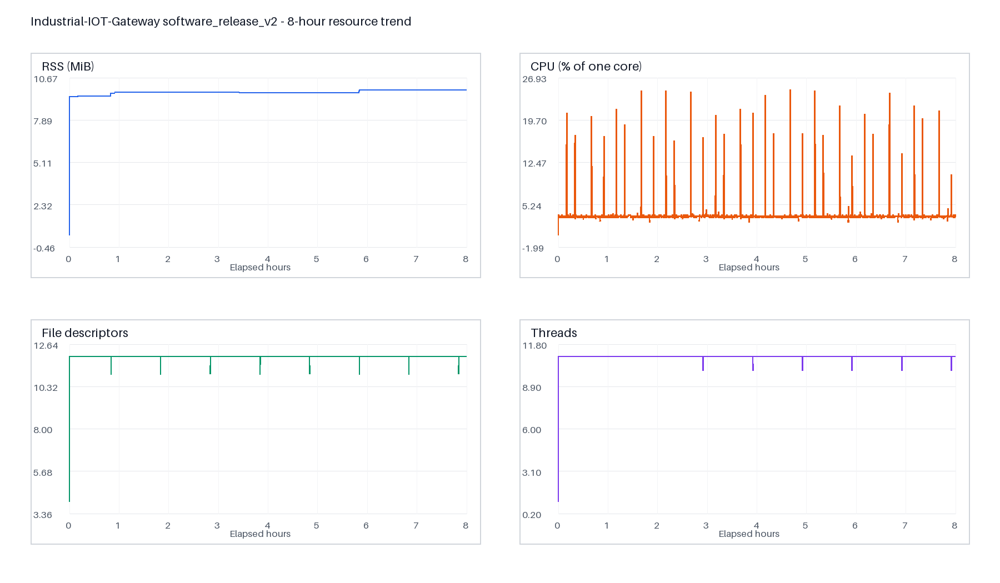

# P3-S6 性能与可靠性报告

> 数据集：`software_release_v2`  
> run ID：`20260812T184831Z_soak_release_ecb4cac_001`  
> 冻结提交：`ecb4cacdf56e187940b341d647ff1529ca2f0b0c`

## 1. 结论

连续 8 小时 PTY + 本地 Mosquitto 软件长稳 PASS。程序完成 748,727 个请求事件、688,137 个
正常窗口请求和 127,827 条 MQTT 消息；56 个预定故障窗口全部触发并恢复。资源没有出现超过
冻结门限的持续增长，队列和关闭路径没有未解释失败。

图由 `resource_samples.jsonl` 的 5,744 个约 5 秒采样点生成。CPU 按单核百分比统计；
初始低 RSS/fd/线程点是进程启动瞬态，不参与 warm-up 后趋势判断。

## 2. 性能指标

| 指标 | 实测 | 门限 | 结论 |
|---|---:|---:|---|
| 正常请求成功率 | 99.9685% | ≥99.9% | PASS |
| 正常吞吐 | 26.2005 requests/s | ≥20.96 | PASS |
| 成功延迟 P95 | 0 ms | ≤100 ms | PASS |
| 成功延迟 P99 | 0 ms | ≤250 ms | PASS |
| 成功延迟最大值 | 20 ms | <500 ms | PASS |
| 非目标从站最大成功间隔 | 2.998 s | ≤10 s | PASS |
| heartbeat 最大间隔 | 7.213 s | ≤30 s | PASS |
| 关闭耗时 | 4 ms | ≤5000 ms | PASS |

P95/P99 为 0 ms 是毫秒整数记录下的大量本地 PTY 请求完成时间小于 1 ms，并不表示物理串口
延迟为零，也不能外推为真实 RS485 性能。

## 3. 资源指标

| 指标 | 实测 | 门限 | 结论 |
|---|---:|---:|---|
| RSS 峰值 | 9.902 MiB | ≤256 MiB | PASS |
| RSS 斜率 | 0.0404 MiB/hour | ≤2 MiB/hour | PASS |
| 首末稳态 RSS 中位数差 | 0.430 MiB | ≤16 MiB | PASS |
| CPU 平均 | 3.410% 单核 | ≤50% | PASS |
| CPU P95 | 3.391% 单核 | ≤80% | PASS |
| 高 CPU 持续时间 | 0 s | ≤300 s | PASS |
| fd 峰值 / 稳态漂移 | 12 / 0 | ≤64 / ≤4 | PASS |
| 线程峰值 / 稳态漂移 | 11 / 0 | ≤32 / ≤2 | PASS |

RSS 在启动和少量运行阶段形成阶梯式 allocator 高水位，随后平台稳定；斜率和首末稳态差同时
通过，因此当前证据没有显示持续泄漏。但这仍是一次 8 小时观测，不等于数学证明不存在所有泄漏。

## 4. 故障恢复与数据正确性

每 3600 秒循环包含静默、650 ms 晚响应、坏 CRC、截断帧、异常码、broker 停止和 PTY 断开，
共执行八轮。每类故障均有触发、预期错误分类和恢复 oracle。晚响应隔离累计 302 次，丢弃
692 bytes；健康从站最大成功间隔仍为 2.998 秒，证明修复没有靠放宽 10 秒门限通过。

MQTT 断开/重连为 9/9；broker 故障期间串口继续运行。publish 队列高水位 358/1024，
request/measurement 队列高水位分别为 1/256、7/512。普通过期 fresh 丢弃 2 条，且
`dropped == expired_fresh_dropped`；critical enqueue failure、drain expired 和关闭时未确认
消息均为 0。

## 5. 证据容量与完整性

证据目录实际占用 511,325,274 bytes，低于 5 GiB v2 上限。最大 JSONL 分段不超过 64 MiB；
`SHA256SUMS` 完整复核通过，`failures.json=[]`。因此把 v1 的 1 GiB 总量上限调整为 5 GiB
解决了容量预算过紧，但没有取消单段轮转或磁盘余量保护。

## 6. 能力声明边界

可声明：在指定 WSL2 x86_64、PTY、回环 Mosquitto、冻结配置与提交下，软件 release profile
连续 8 小时通过自动验收。

不可声明：树莓派温度/降频表现、ARM64 性能、USB-RS485 电气可靠性、真实设备响应时延、
生产网络 SLA、MQTT TLS/鉴权可靠性或硬件 8 小时长稳。
